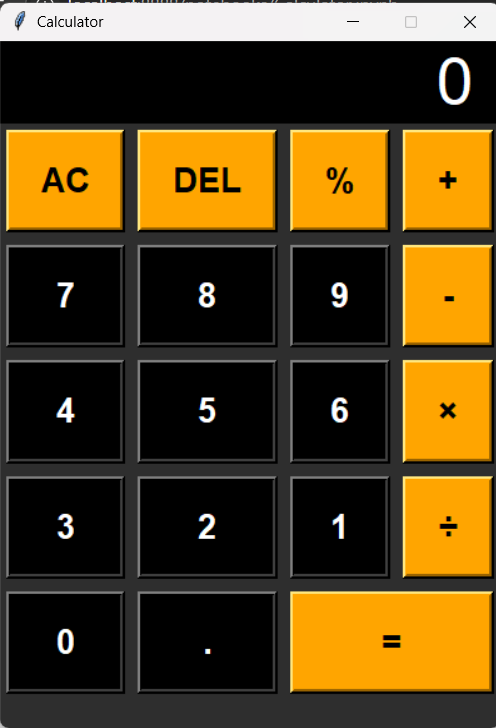

# Simple Calculator App

This is a basic calculator app built using **Python** inside a **Jupyter Notebook**. It performs simple arithmetic operations and demonstrates beginner-friendly Python logic.

# Features

- ✅ Addition
- ✅ Subtraction
- ✅ Multiplication
- ✅ Division
- ✅ Clean and simple code
- ✅ Built using Jupyter Notebook

# Screenshot
  
